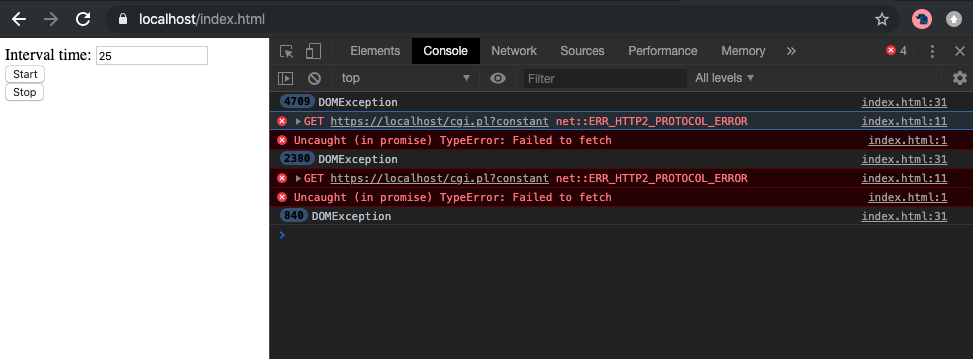

# Motivation

The motivation of this repository is to reproduce the `net::ERR_HTTP2_PROTOCOL_ERROR` when you send a lot of HTTP 2 request and cancel some.

The repository contains:

*  A Perl CGI script (`src/cgi.pl`) which returns 105kb of random JSON
*  A Javascript script (`src/index.html`) which call the CGI script (with `fetch` API)
*  An Apache configuration (`src/httpd.conf`) with HTTP2 and a valid SSL certificate.

The Javascript program call 10 times (in parallel) the CGI script every 50ms (by default) and cancel them when they are still running. Meanwhile another request is runned every 200ms (never canceled). 

# How to run

## 1. Generate a SSL certificate

The` generate-ssl.sh` needs [mkcert](https://github.com/FiloSottile/mkcert) to work. Please install it before running the script.

```
./generate-ssl.sh
```

If you want use another tool to generate valid SSL certificate, feel free to use it. Just put the `server.crt` and the `server.key` files in `ssl` directory.

## 2. Run Apache

You'll need [docker](https://docs.docker.com/install/) and [docker-compose](https://docs.docker.com/compose/) to run it. If you have both, you can run the following command:

```
docker-compose up -d
```

## 3. Generate the bug

You can go to [https://localhost/index.html](https://localhost/index.html) to test it. You can change the interval time to generate the bug. The results looks like this:


